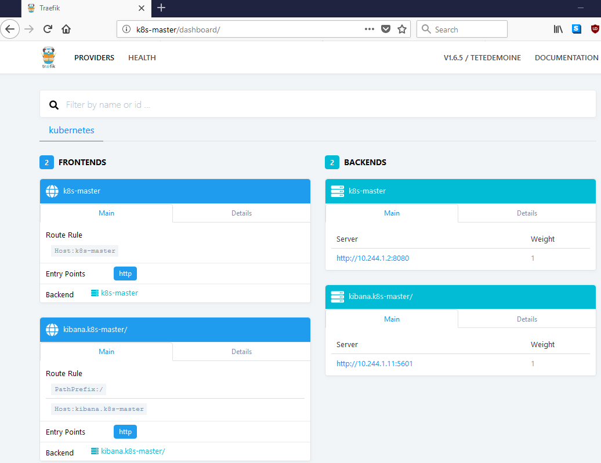
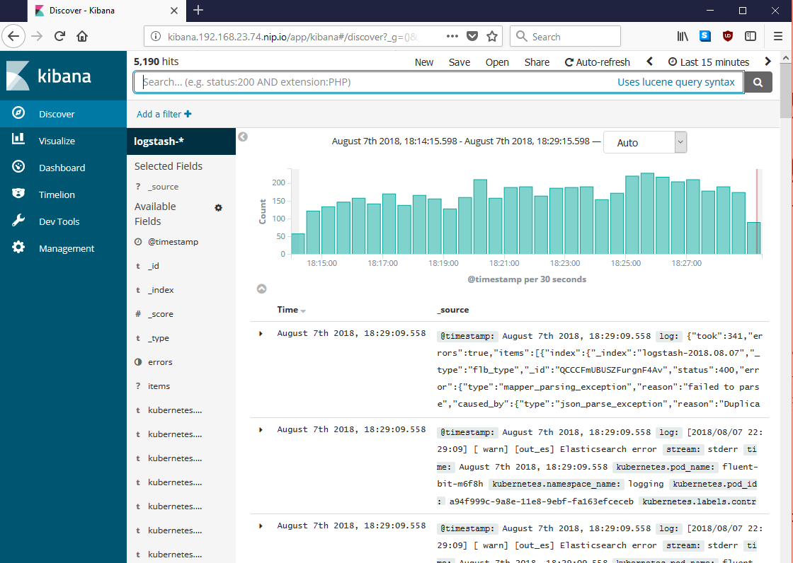

# Introduction

This document provide steps to setup an Elasticsearh cluster on Kubernetes.

#### References

* [Log aggregation with ElasticSearch, Fluentd and Kibana stack on ARM64 Kubernetes cluster](https://medium.com/@carlosedp/log-aggregation-with-elasticsearch-fluentd-and-kibana-stack-on-arm64-kubernetes-cluster-516fb64025f9)
* [How to deploy an EFK stack to Kubernetes](https://blog.ptrk.io/how-to-deploy-an-efk-stack-to-kubernetes/)
* [pires/kubernetes-elasticsearch-cluster](https://github.com/pires/kubernetes-elasticsearch-cluster)

 `Make sure you run these commands remotely. Not from the `k8s-master` directly through ssh.`

**WARNINGS!!! Read references links for details.**

* Services are not configured with security.
* Logs are written on `emptyDir` storage so they are not persistent.
* Need to tune JVM parameters


We'll put into the `logging` namespace.

```
kubectl create namespace logging
```

Setup an alias in `~/.bash_aliases`

```
alias kctl='kubectl --namespace logging'
```

Activate the aliase

```
source ~/.bash_aliases
```

Change to `elasticsearch-cluster/`

```
elasticsearch-cluster/
```

Setup the ElasticSearch master

```
kctl create -f es-discovery-svc.yaml
kctl create -f es-svc.yaml
kctl create -f es-master.yaml
kctl rollout status -f es-master.yaml
```

The output would be

```
ubuntu@ritz-k8s:~/bbb-k8s-cluster/elasticsearch/elasticsearch-cluster$ kctl create -f es-discovery-svc.yaml
service/elasticsearch-discovery created
ubuntu@ritz-k8s:~/bbb-k8s-cluster/elasticsearch/elasticsearch-cluster$ kctl create -f es-svc.yaml
service/elasticsearch created


ubuntu@ritz-k8s:~/bbb-k8s-cluster/elasticsearch/elasticsearch-cluster$ kctl create -f es-master.yaml
deployment.apps/es-master created


ubuntu@ritz-k8s:~/bbb-k8s-cluster/elasticsearch/elasticsearch-cluster$ kctl rollout status -f es-master.yaml
Waiting for deployment "es-master" rollout to finish: 0 of 3 updated replicas are available...
Waiting for deployment "es-master" rollout to finish: 1 of 3 updated replicas are available...
Waiting for deployment "es-master" rollout to finish: 2 of 3 updated replicas are available...
deployment "es-master" successfully rolled out
```

Setup the ingest service

```
kctl create -f es-ingest-svc.yaml
kctl create -f es-ingest.yaml
kctl rollout status -f es-ingest.yaml
```

The output

```
ubuntu@ritz-k8s:~/bbb-k8s-cluster/elasticsearch/elasticsearch-cluster$ kctl create -f es-ingest-svc.yaml
service/elasticsearch-ingest created


ubuntu@ritz-k8s:~/bbb-k8s-cluster/elasticsearch/elasticsearch-cluster$ kctl create -f es-ingest.yaml
deployment.apps/es-ingest created


ubuntu@ritz-k8s:~/bbb-k8s-cluster/elasticsearch/elasticsearch-cluster$ kctl rollout status -f es-ingest.yaml
Waiting for deployment "es-ingest" rollout to finish: 0 of 2 updated replicas are available...
Waiting for deployment "es-ingest" rollout to finish: 1 of 2 updated replicas are available...
deployment "es-ingest" successfully rolled out
```

Setup the data service

```
kctl create -f es-data.yaml
kctl rollout status -f es-data.yaml
```

The output

```
ubuntu@ritz-k8s:~/bbb-k8s-cluster/elasticsearch/elasticsearch-cluster$ kctl create -f es-data.yaml
deployment.apps/es-data created


ubuntu@ritz-k8s:~/bbb-k8s-cluster/elasticsearch/elasticsearch-cluster$ kctl rollout status -f es-data.yaml
Waiting for deployment "es-data" rollout to finish: 0 of 2 updated replicas are available...
Waiting for deployment "es-data" rollout to finish: 1 of 2 updated replicas are available...
deployment "es-data" successfully rolled out
```

Check if everything is working.


```
kctl get svc,deployment,pods -l component=elasticsearch
```

This sould display

```
ubuntu@ritz-k8s:~/bbb-k8s-cluster/elasticsearch/elasticsearch-cluster$ kctl get svc,deployment,pods -l component=elasticsearch
NAME                              TYPE        CLUSTER-IP       EXTERNAL-IP   PORT(S)    AGE
service/elasticsearch             ClusterIP   10.103.81.111    <none>        9200/TCP   10m
service/elasticsearch-discovery   ClusterIP   None             <none>        9300/TCP   10m
service/elasticsearch-ingest      ClusterIP   10.105.113.142   <none>        9200/TCP   6m

NAME                              DESIRED   CURRENT   UP-TO-DATE   AVAILABLE   AGE
deployment.extensions/es-data     2         2         2            2           3m
deployment.extensions/es-ingest   2         2         2            2           6m
deployment.extensions/es-master   3         3         3            3           10m

NAME                             READY     STATUS    RESTARTS   AGE
pod/es-data-79c979d574-fvrv5     1/1       Running   1          3m
pod/es-data-79c979d574-jfsxb     1/1       Running   0          3m
pod/es-ingest-bbc7b7d4b-5885l    1/1       Running   0          6m
pod/es-ingest-bbc7b7d4b-xb4lt    1/1       Running   0          6m
pod/es-master-64dc98fd59-48jmx   1/1       Running   0          10m
pod/es-master-64dc98fd59-klhvz   1/1       Running   0          10m
pod/es-master-64dc98fd59-xhnjh   1/1       Running   0          10m

```

Setup a curator to delete logs regularly to avoid filling up our storage space.

```
kctl create -f es-curator-config.yaml

kctl create -f es-curator_v1beta1.yaml

kctl get cronjobs
```

The result would be

```
ubuntu@ritz-k8s:~/bbb-k8s-cluster/elasticsearch/elasticsearch-cluster$ kctl create -f es-curator-config.yaml
configmap/curator-config created


ubuntu@ritz-k8s:~/bbb-k8s-cluster/elasticsearch/elasticsearch-cluster$ kctl create -f es-curator_v1beta1.yaml
cronjob.batch/curator created


ubuntu@ritz-k8s:~/bbb-k8s-cluster/elasticsearch/elasticsearch-cluster$ kctl get cronjobs
NAME      SCHEDULE    SUSPEND   ACTIVE    LAST SCHEDULE   AGE
curator   1 0 * * *   False     0         <none>          8s

```

Setup Fluent-bit to send logs to ElasticSearch

```
cd fluent-bit
```

Setup service, roles, and config.

```
kubectl create -f fluent-bit-service-account.yaml
kubectl create -f fluent-bit-role.yaml
kubectl create -f fluent-bit-role-binding.yaml

kubectl create -f output/elasticsearch/fluent-bit-configmap.yaml
```

The output would be

```
ubuntu@ritz-k8s:~/bbb-k8s-cluster/elasticsearch/fluent-bit$ kubectl create -f fluent-bit-service-account.yaml
serviceaccount/fluent-bit created


ubuntu@ritz-k8s:~/bbb-k8s-cluster/elasticsearch/fluent-bit$ kubectl create -f fluent-bit-role.yaml
clusterrole.rbac.authorization.k8s.io/fluent-bit-read created


ubuntu@ritz-k8s:~/bbb-k8s-cluster/elasticsearch/fluent-bit$ kubectl create -f fluent-bit-role-binding.yaml
clusterrolebinding.rbac.authorization.k8s.io/fluent-bit-read created


ubuntu@ritz-k8s:~/bbb-k8s-cluster/elasticsearch/fluent-bit$ kubectl create -f output/elasticsearch/fluent-bit-configmap.yaml
configmap/fluent-bit-config created
```

Setup a DaemonSet

```
kctl apply -f  output/elasticsearch/fluent-bit-ds.yaml
```

The output

```
ubuntu@ritz-k8s:~/bbb-k8s-cluster/elasticsearch/fluent-bit$ kctl apply -f  output/elasticsearch/fluent-bit-ds.yaml
daemonset.extensions/fluent-bit created
```

We will now deploy Kibana to be able to access the logs on ElasticSearch

```
kctl create -f kibana-deployment.yaml
```

The output

```
ubuntu@ritz-k8s:~/bbb-k8s-cluster/elasticsearch/fluent-bit$ kctl create -f kibana-deployment.yaml
deployment.apps/kibana created

```

Now we need to setup an ingress on Traefik to be able to access Kibana from the browser.

Open up `kibana-ingress.yaml` and set `host` to `kibana.k8s-master` so we Traefik can route the request to Kibana.

```
spec:
    rules:
      - host: kibana.k8s-master
        http:
            paths:
                - path: /
                  backend:
                      serviceName: kibana
                      servicePort: http

```

Apply the ingress configuration.

```
kctl create -f kibana-ingress.yaml
```

The output would be 

```
ubuntu@ritz-k8s:~/bbb-k8s-cluster/elasticsearch/fluent-bit$ kctl create -f kibana-ingress.yaml
service/kibana created
ingress.extensions/kibana created
```

Looking at the Traefik Dashboard, you would see that Traefik has an ingress to Kibana.




Access Kibana from yout browser by pointing to `http://kibana.192.168.23.74.nip.io`. Then you need to create an index. Use a wildcard to index logs beginning with `logstash-` by entering `logstash-*` and use `@timestamp` as the field.

 