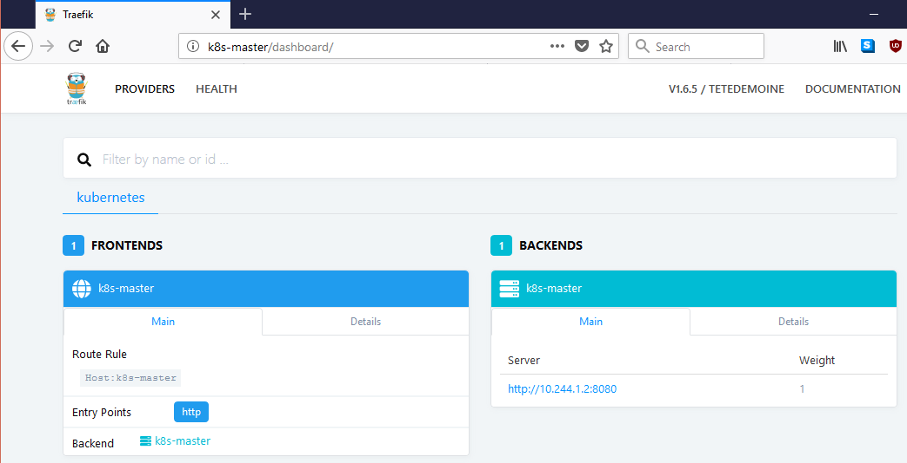

# Introduction

This document describes how to setup [Traefik](https://traefik.io/) ingress controller in OpenStack.

### References

 * [Kubernetes Ingress Controller](https://docs.traefik.io/user-guide/kubernetes/)

 `Make sure you run these commands remotely. Not from the `k8s-master` directly through ssh.`


#### Setup Role Based Access Control (RBAC)

```
kubectl apply -f traefik-rbac.yaml
```

The output would be the following:

```
ubuntu@ritz-k8s:~/bbb-k8s-cluster/traefik$ kubectl apply -f traefik-rbac.yaml
clusterrole.rbac.authorization.k8s.io/traefik-ingress-controller created
clusterrolebinding.rbac.authorization.k8s.io/traefik-ingress-controller created
```

#### Deploy Træfik using DaemonSet

Edit `traefik-ds.yaml` and make sure that the `externalIPs:` point to `k8s-master`s IP. Hostnames doesn't work.

```
kind: Service
apiVersion: v1
metadata:
  name: traefik-ingress-service
  namespace: kube-system
spec:
  selector:
    k8s-app: traefik-ingress-lb
  ports:
    - protocol: TCP
      port: 80
      name: web
    - protocol: TCP
      port: 8080
      name: admin
  externalIPs:
  - 192.168.23.74

```

```
kubectl apply -f traefik-ds.yaml
```

Here is the output of the command.

```
ubuntu@ritz-k8s:~/bbb-k8s-cluster/traefik$ kubectl apply -f traefik-ds.yaml
serviceaccount/traefik-ingress-controller created
daemonset.extensions/traefik-ingress-controller created
service/traefik-ingress-service created
```

Check if the service has been created.

```
kubectl get svc --namespace=kube-system
```

The output is

```
ubuntu@ritz-k8s:~/bbb-k8s-cluster/traefik$ kubectl get svc --namespace=kube-system
NAME                      TYPE        CLUSTER-IP       EXTERNAL-IP     PORT(S)           AGE
kube-dns                  ClusterIP   10.96.0.10       <none>          53/UDP,53/TCP     4h
traefik-ingress-service   ClusterIP   10.100.255.236   192.168.23.74   80/TCP,8080/TCP   3m
```

Check if we can access port 80 of Traefik. Should respond `404 page not found`.

```
ubuntu@ritz-k8s:~/bbb-k8s-cluster/traefik$ curl http://192.168.23.74
404 page not found
```


#### Exposing the Traefik Web UI

Edit `traefik-web-ui.yaml` and change `host` to resolve to the `externalIPs` you set above.

```
spec:
  rules:
  - host: k8s-master
    http:
      paths:
      - backend:
          serviceName: traefik-web-ui
          servicePort: 80
```

```
kubectl apply -f traefik-web-ui.yaml
```

The output would be

```
ubuntu@ritz-k8s:~/bbb-k8s-cluster/traefik$ kubectl apply -f traefik-web-ui.yaml
service/traefik-web-ui created
ingress.extensions/traefik-web-ui created

```

You should be able to access the Traefik Web UI on your browser by going to `http://k8s-master` which would display 




